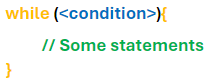
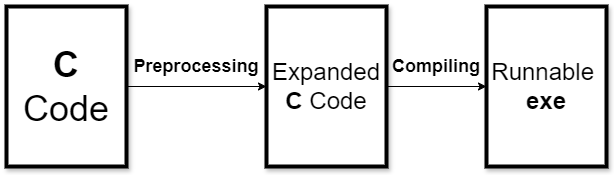

# Session 2 - The Cequel

Welcome to the Cequel! 
<small> See what I did there </small>

I hope you enjoyed Session 1 and are now comfortable with using variables, for loops, and if statements to create very basic **C** programs (including commenting and being able to compile your code), and are familiar with arrays and the interesting part of **C**: undefined behaviour and how you can do many things in **C** which shouldn't be allowed (we'll see some more examples in this session!).  

It's getting to the harder - but more interesting - stuff ...

Good luck and happy coding!

## Contents 

- <a href="#Pointers" style="color: black;"> Pointers </a>
    - <a href="#MemoryAddresses" style="color: black;"> Memory Addresses </a>
    - <a href="#ThePoint" style="color: black;"> The Point (Intro to Pointers) </a>
    - <a href="#Dereferencing" style="color: black;"> Dereferencing </a>
    - <a href="#NullPointer" style="color: black;"> The Null Pointer </a>
    - <a href="#PointerExercises" style="color: black;"> Pointer Exercises </a>
- <a href="#Functions" style="color: black;"> Functions </a>
    - <a href="#Void" style="color: black;"> Void </a>
    - <a href="#FunctionPrototypes" style="color: black;"> Function Prototypes </a>
    - <a href="#Main" style="color: black;"> Revisiting Hello World </a>
    - <a href="#FunctionExercises1" style="color: black;"> Function Exercises 1 </a>
    - <a href="#PassingPointers" style="color: black;"> Passing Around Pointers </a>
    - <a href="#FunctionExercises2" style="color: black;"> Function Exercises 2 </a>
- <a href="#RevisitingArrays" style="color: black;"> Revisiting Arrays </a>
    - <a href="#ArraysPointers" style="color: black;"> Arrays and Pointers </a>
    - <a href="#PointerDecay" style="color: black;"> Array Decay </a>
    - <a href="#PointerArithmetic" style="color: black;"> Pointer Arithmetic </a>
    - <a href="#ArrayExercises" style="color: black;"> Array Exercises </a>
- <a href="#Strings" style="color: black;"> Strings </a>
    - <a href="#StringLiteral" style="color: black;"> Initialising Strings With Literals </a>
    - <a href="#StringManipulation" style="color: black;"> String Manipulation </a>
    - <a href="#StringExercises" style="color: black;"> String Exercises </a>
- <a href="#Memory" style="color: black;"> Memory Allocation </a>
    - <a href="#Malloc" style="color: black;"> Malloc </a>
    - <a href="#MemoryLeaks" style="color: black;"> Freeing Memory </a>
    - <a href="#AllocationFail" style="color: black;"> What If Allocation Fails? </a>
    - <a href="#CallocRealloc" style="color: black;"> Calloc & Realloc </a>
    - <a href="#MemoryExercises" style="color: black;"> Memory Exercises </a>
- <a href="#Optional" style="color: black;"> Optional Exercises </a>

## <a name="Pointers"> Pointers </a>

We are about to learn arguably the most fundamental part of **C**: pointers. They may seem scary but we'll soon see that they're not *actually* that bad! 

### <a name="MemoryAddresses"> Memory Addresses: How Variables Are Stored </a>

We know that variables store values for us; but what does this actually look like, in the memory of our computers? 

Let's think about the following variable initialisations:
```c
char a = 5;
char b = 14;
```

These variables correspond to the following address table:

| Memory Address | Value Stored |
| -------------- | ------------ |
| 6422039        | 5            |
| 6422040        | 14           | 

We can see that the variable **a** has been stored at 6422039, and that variable **b** has been stored at 6422040 (the next **memory address**). These **memory addresses** tell you where you'd find the variables in all of the RAM your computer is currently using so they tend to be fairly large values.

 Memory addresses are actually in **binary** (which uses only 2 symbols: `0, 1`) and converting to **denary** (our numbering system which uses 10 symbols: `0, 1, 2, 3, 4, 5, 6, 7, 8, 9`) is a bit of a pain, so we don't usually represent addresses with denary. However, because of the large values that memory addresses tend to be, we can't exactly read them in their binary form since you get values like this: `11000011111111000010111` (`6422039` in binary). 

 Therefore, we typically represent addresses using **hexadecimal** (which uses 16 symbols: `0, 1, 2, 3, 4, 5, 6, 7, 8, 9, A, B, C, D, E, F`) which is both more compact than binary and, unlike denary, can be easily converted to and from binary. 
 
 Our memory addresses in various different bases:

| Denary  | Binary                    | Hexadecimal (what is commonly used!) | 
| ------  | ------------------------- | ------------------------------------ |
| 6422039 | 11000011111111000010111   | 61FE17                               |
| 6422040 | 11000011111111000011000   | 61FE18                               |

### <a name="ThePoint"> The Point </a>

It turns out that we can actually access the memory address of a variable in **C**, with the **address** operator (**&**). This returns a value which is the memory address of a variable so this value is said to **point** to that variable. This value is a **pointer**! Pointers have their own format specifier **%p** (**p** for **p**ointer) which we'll use to inspect some pointers:

```c
char a = 5;
char b = 14;

printf("%p\n", &a); // 61FE17
printf("%p\n", &b); // 61FE18
```

So we know variable **a** is stored at memory address `61FE17`, and variable **b** is stored at memory address `61FE18`. 

So far, we've only been dealing with pointers to **char** which is convenient since each char takes up **1 byte** in most machines, and each bit of memory (that has an address) stores **1 byte** of memory; what about ints which typically take up **4 bytes**? How are these stored in memory? 

```c
int a = 7;
int b = 22; 

printf("%p\n", &a); // 61FE18
printf("%p\n", &b); // 61FE1C
```

This can be visualised:


*Red cells are taken up by int a, blue cells are taken up by int b*

Since each cell (bit of memory) can store 1 byte and ints take up 4 bytes, each int covers 4 cells. The pointer contains the memory address of the first cell; when you check the contents of a variable using its pointer, you have to keep in mind the number of bytes it takes up so you know how many cells to check.  

We can also initialise variables for pointers which require:
1) the **type** of value it's pointing to 
2) a **memory address** (the variable's value) 
3) a **name** for the variable
4) an asterisk **\*** to tell **C** that it's a pointer


Of course, you can opt to just *declare* the pointer and not give it a value but this will lead to undefined behaviour.

Interestingly, the position of the **\*** doesn't matter as long as it's between the type and the name of the pointer. All of the following are valid pointer declarations:
```c
char* a, char * b, char *c;
```

I would personally recommend the first one: putting the **\*** next to the type makes it obvious that it's related to the type. For example, that `char*` is a type that is different from the type `char`.  

### <a name="Dereferencing"> Dereferencing Pointers </a>

We can access the value pointed to by the pointer by using the **dereferencing** operator (**\***); ***don't get confused*** by the fact that **\*** is used both in the **type** when you're declaring a variable and as the dereferencing operator - they are completely different uses of the symbol!

```c
int a = 51;
int* pointerToA = &a;
int b = *pointerToA; // the pointer "pointerToA" is said to be dereferenced here 
```

So we can access the value stored by pointers by dereferencing the pointer, and actually manipulate it as well:

```c
int a = 3;
int* pointerToA = &a;

(*pointerToA)++; // updating a 

printf("%d\n", a); // 4
```
*Recall that you do the operations inside the brackets first!*

### <a name="NullPointer"> The Null Pointer </a>

There's a special kind of pointer that points to no memory address called the **null** pointer. This value is special because any type of pointer can be set to **null**!

```c
int* p1 = NULL;
char* p2 = NULL;
short* p3 = NULL;
```

Note that the definition for the null pointer lives inside several libraries including `stdio.h`, so include one of them if you want to use `NULL`. 

The null pointer is quite useful for actions which *should* give you a pointer but may fail (in that case, you'd want to give a null pointer).

### <a name="PointerExercises"> Pointer Exercises </a>

1) Given two `int*` pointers `a, b`, print their sum and product. 

```c
int x = 5; // don't use this
int y = 6; // don't use this
int* a = &x; // use this
int* b = &y;  // use this 
```

Also edit the values of `x, y` through their pointers `a, b`. 

2) You can set ints directly to binary or hex values like so:
```c
int a = 0x5F;
printf("%d\n", a); // 95

int b = 0b01101;
printf("%d\n", b); // 13
```

- For binary, you start it with `0b` (**b** for **b**inary)
- For hex, you start it with `0x` (**x** for he**x**)

Can you print your name out using binary or hex values? 

## <a name="Functions"> Functions </a>

If you want to write good code, then you want to write organised code. You want to write code that easily clicks into place with other code like lego, and can be easily reused.
This is called **adaptability:** how easily and quickly you can modify your code to introduce new features. 

We can organise our code more with **functions**, which we've already been using (**printf** is a function)! A function is a block of code that we can execute by **calling** the function, with some properties:
- you can pass values to the function by calling the function with **arguments**; think about *printf* - it wouldn't be very useful if you couldn't pass it the values you want to output 
- the function can **return** a *single* value to its caller

The syntax of declaring a function:


An example of a simple function:
```c 
int sumTwoInts(int a, int b){
    int result = a + b;
    return result; // result matches return type of sumTwoInts (int)
}
```

Or even simpler:
```c
int sumTwoInts(int a, int b){
    return a + b;
}
```

Note that **a, b** here are variables and you can treat them like variables. 

We can call this function like so:

```c
int x = 10;
int y = 5;
int sum = sumTwoInts(x, y); 

printf("Sum of x, y: %d\n", sum); // 15
printf("Sum of 2, 4: %d\n", sumTwoInts(2, 4)); // 6
```

Notice how we can use the return value directly (like in summing 2 and 4), or store it in a variable (like in summing 10 and 5). 

**Note:** Sometimes people will call the variables, that take on the values of the arguments, **parameters**. So you call functions with **arguments**, and these get assigned as values to the **parameters** in the function. In other words, **parameters** are the names and **arguments** are the values. 

### <a name="Void"> Void </a>

Sometimes, like in `printf`, you may not want to return something: you might want the function to just carry out some action(s) and have no reason to return anything.

You can just set the function's return type to **void**:

```c
#include <stdio.h>

void shout(){
    printf("THIS FUNCTION SHOUTS THIS MESSAGE!!!!!!\n");
}

int main(){
    shout(); // trying to set a variable's value to this will error!
}
```

So we now know that `printf` is a function of return type void. 

We can also use **void** to tell **C** that our function takes in no arguments; of course, we could also just leave the arguments blank: 
```c
void scream(){
    printf("AHHH THIS FUNCTION SHOULD HAVE NO ARGUMENTS!!!\n");
}
```

The issue with this is that we can *still* call scream with arguments, but **C** will discard these arguments for us: 

```c
int main(){
    scream(5); // still prints fine: AHHH THIS FUNCTION SHOULD HAVE NO ARGUMENTS!!!
}
```

If we want **C** to complain and throw a fit when we try to give it arguments, then we can use **void**:

```c
void scream(void){
    printf("AHHH THIS FUNCTION SHOULD HAVE NO ARGUMENTS!!!\n");
}
```

Now we cannot compile this code if we call scream with arguments since **C** will complain. This is considered **good practice** because it gets the compiler to tell us when we've made a mistake, so we can catch any potential errors sooner! We already have so much hard-to-debug undefined behaviour in **C**, so let's try to make it easier on ourselves `:)`

### <a name="FunctionPrototypes"> Function Prototypes </a>

Some programmers like to put **main** at the top, since seeing the entry-point of the program first is quite useful for going through tons of different code files. When we have other functions, we run into a problem: 

```c
#include <stdio.h>

int main(){
    printf("%d\n", diff(19, 16));
}

int diff(int a, int b){
    return a - b;
}
```

The main function can't see `diff` since it's initialised after main (some compilers will make this work anyway but we want to write good **C** code that works for all valid **C** compilers).

We can still achieve this by **prototyping** functions:


```c
#include <stdio.h>

int diff(int a, int b);

int main(){
    printf("%d\n", diff(19, 16));
}

int diff(int a, int b){
    return a - b;
}
```

When we prototype a function, we don't include the body of it (the statements that make it actually work); we just include its return type, name, and arguments. 

You can think of prototyping a function as *declaring* the function, and writing the full function as *initialising* the function.


### <a name="Main"> Revisiting Main </a>

Now that we know about functions, we can revisit our old friend - the **main** function. 
```c
int main(){
}
```

**C** lets us get away with not explicitly returning an int for main, but what would it mean if we did? 
- Returning **0** signals that the program exited correctly
- Returning a **non-zero** value signals the program exited abnormally (if something goes wrong)

Try to run the following program, which exits abnormally:
```c
#include <stdio.h>

int main(){
    printf("oopsie!\n");
    return -1;
}
```

It should output "oopsie!" and then signal to you that something went wrong. 

**Note:** **C** compilers used to require you to explicitly return `0` from main and so there will be some compilers that error if you don't, so it's considered good practice to **use return** in your main function. Often, `-1` is used to signal incorrect execution.

Did you know **main** can also receive arguments from the command-line? 

```c
int main(int argc, char* argv[]){
    printf("Number of arguments: %d\n\n", argc);
    
    for (int i = 0; i < argc; i++){
        printf("%s\n", argv[i]);
    }
}
```

The **main** function gets: 
1) number of arguments which we call **argc** for **arg**ument **c**ount 
2) an array of pointers to characters, which we'll soon see is an array of strings (in the *Revisiting Arrays* section)

Right now, we won't question *how* pointers to characters are entire strings and just use **%s** to print them. 

One confusing way of writing **main** is with **void** in place of arguments, because 

### <a name="FunctionExercises1"> Function Exercises 1 </a>

1) In higher-level languages, you have to return a value from a non-void function. In **C**, you can return nothing from a non-void function like so:

```c
int div(int a, int b){
    if(b != 0){
        return a/b;
    }
}
```
*No value is returned from div when b=0*

Can you see what happens when div returns nothing? Can you output its return value? 

2) Read the solution to Exercise 1 (`cFiles/exerciseSolutions/FunctionExercises1/Exercise1.c`)

3) Using arguments to the main function, write a program that takes a first name and second name from the command-line and outputs "Your name is insert-first-name insert-last-name!"

### <a name="PassingPointers"> Passing Around Pointers </a>

When you pass values to a function, you are just giving it the values. Editing those values inside the function will do nothing to any variables that hold those values. For example: 

```c
void print1GreaterThanN(int n){
    n++; 
    printf("One greater than n: %d\n", n); 
}

int main(){
    int x = 5; 
    print1GreaterThanN(x);
    printf("%d\n", x); // still 5!

    return 0;
}
```

Inside of `print1GreaterThanN`, we edit the argument (value) we're given so that we output `6`. But the original variable x still holds the value `5` so what's going on here? The variable **n** and the variable **x** actually point to different places in memory, and the value that **n** holds is a copy of the value that **x** holds (at the start of the function)! 

In programming, this is referred to as **passing by value**. What if we *did* want functions to edit the value of a variable? Well, we can do this by passing a pointer! This is called **passing by reference** since we're passing a pointer which points to, or **references**, the variable. 

```c
void print1GreaterThanN(int* n){
    (*n)++; // be very careful with brackets here! *n++ will increment the memory address of the pointer
    printf("One greater than n: %d\n", *n); 
}

int main(){
    int x = 5; 
    print1GreaterThanN(&x);
    printf("%d\n", x); // now 6!

    return 0;
}
```

Since we can get functions to edit values, we can get functions to give us data. We can already do this using **return**, but that limits us to only one value as functions can only return *one value* (or none). By passing pointers to functions, we can get them to set values. 

```c
int positiveNumberCheck(int n, int* isEven, int* isGreater, int* isFavourite){
    if(n <= 0){
        return 0; // could not give properties because number is not a strictly positive number
    }

    if(n%2 == 0){
        *isEven = 1; // recall 1 is considered 'true'
    }

    if(n > 10){
        *isGreater = 1;
    }

    if(n == 37){ // my favourite for now...
        *isFavourite = 1;
    }

    return 1; // ran successfully!
}

int main(){
    int n = 37;
    int isEven = 0; // automatically set to 'false'
    int isGreaterThanTen = 0;
    int isMyFavouriteNumber = 0;

    int succ = positiveNumberCheck(n, &isEven, &isGreaterThanTen, &isMyFavouriteNumber); // succ is short for success

    if(succ){
        printf("%d %d %d \n", isEven, isGreaterThanTen, isMyFavouriteNumber);
    }else{
        printf("Cannot give properties for n = %d\n", n);
    }
}
```

### <a name="FunctionExercises2"> Function Exercises 2 </a>

1) In <a href="#PassingPointers"> Passing Pointers</a>, there is an example of passing by value and we said that the variables **x, n** pointed to different places in memory. Can you edit the code to output the memory addresses of **x** and **n**, and run it to convince yourself?

2) Write a function `doubleMyNumber` which doubles the number passed in, in two ways:
- one way returns the number and does not edit the original variable
- another way edits the original value 

```c
int doubleMyNumber(int n);
void doubleMyNumberEdit(int* n);
```

## <a name="RevisitingArrays"> Revisiting Arrays </a>

We saw last session that arrays are a collection of values that are stored in **contiguous** memory locations (aka the memory locations are right next to each other). 

### <a name="ArraysPointers"> Arrays and Pointers </a>

This sounds familiar... we know that a pointer to an int points to the first byte and the three (or more depending on the machine) other bytes are stored immediately after (or in contiguous memory). 

In fact, what actually is an array? Let's print it! 

```c
int anArray[] = {2, 3, 5, 7, 11};
printf("%d\n", anArray); // 6422016
```

That's interesting, this looks like a memory location (that we've printed using **%d** so displayed as a denary number). Let's try printing it as a pointer, and also printing the memory addresses of values in the array. 

```c
printf("Array: %p\n", anArray); // 61FE00

for(int i = 0; i < 5; i++){
    printf("Element at location: %p\n", &anArray[i]); // 61FE00, 61FE04, 61FE08, 61FE0C, 61FE10
}
```

So the pointer to the first element points to the same address as the array! Hold on though, surely they're not the exact same because we can index arrays using `[]`. 

```c
int anArray[] = {2, 3, 5, 7, 11};
int* p = &anArray[0];

printf("%d\n", p[0]); // 2

for(int i = 1; i < 5; i++){
    printf("%d\n", p[i]); // 3, 5, 7, 11
}

return 0;
```

We can index pointers as well? Are arrays just pointers??? Not quite, but close. There is one **key** difference between arrays and pointers. 

### <a name="PointerDecay"> Array Decay </a>

Call `sizeof` on an array, and call `sizeof` on a pointer to the first element in the array. 

```c
int anArray[] = {2, 3, 5, 7, 11};
int* p = &anArray[0];

// one key difference: sizeof 

printf("sizeof array: %d\n", sizeof(anArray)); // 20
printf("sizeof pointer: %d\n", sizeof(p)); // 8
```

You will see that `sizeof(array)` tells us the number of bytes the array takes up, whereas `sizeof(pointer)` tells us the number of bytes that the pointer itself takes up (so how many bytes needed to store the memory address). 

If we only have the pointer, then we can't find out how many elements there are in the array. So we can't index or loop through the elements of the array since we can't tell what's in the array or not, beyond the first element.

So if we wanted to use a pointer as an array, we would have to keep track of the size of the array in another variable. This is important because there is a key situation where an array becomes just a pointer, and loses information about the size of the array: this is **array decay** and it happens when you pass an array to a function. 

```c
void passingArray(int passedArray[]){
    printf("%d\n", sizeof(passedArray)); // 8 on my machine
}

int main(){
    int ourArray[] = {1, 3, 6, 10, 15};
    printf("%d\n", sizeof(ourArray)); // 20 on my machine  

    passingArray(ourArray);

    return 0;
}
```

We can see that `ourArray` decays into `passedArray` and loses information about its size; this happens because `passedArray` **is** actually just the pointer to the first element, so its size is the size of a pointer on my machine (which is 8 bytes). Due to array decay, we have to provide the length of an array whenever we pass it through a function. 

**Note:** Using `int array[]` and `int* array` is equivalent for pointers. Since an array decays into a pointer when it's passed to a function, we can use either form. 

```c
void passingArray(int* passedArray, int length){
    printf("Last element: %d\n", passedArray[length-1]);
}

int main(){
    int ourArray[] = {1, 3, 6, 10, 15};
    printf("%d\n", sizeof(ourArray)); // 20 on my machine  

    passingArray(ourArray, 5);

    return 0;
}
```

### <a name="PointerArithmetic"> Pointer Arithmetic </a>

*Arithmetic! The mathematicians have got us in their grasp again!* 

You can perform operations on pointers! Most importantly, increment (`++`). Be careful though, because pointer arithmetic isn't exactly the same as integer arithmetic. 

```c
int a = 0;
int* p = &a; 

printf("%p\n", p); // 61FE14

p++; // increment by 1

printf("%p\n", p); // 61FE18
```

So incrementing by `1` increased the pointer's address by `4`! It turns out the number that the memory address increases by **depends on the type of the pointer**. This extends to regular old addition as well! So you can actually traverse an array by adding to the pointer like so:

```c
int array[] = {1, 1, 2, 3, 5};

for(int i = 0; i < 5; i++){
    printf("%d\n", *(array+i)); // 1, 1, 2, 3, 5
}
```
*Though only psychopaths traverse like this* 

### <a name="ArrayExercises"> Array Exercises </a>

1) Write a function to print all the values in an array. Can you make it so it prints all the contents on one line? 

2) Can you traverse through the following array using `++` and the pointer `i`?

```c
int a[] = {1, 1, 2, 3, 5, 8, 13};
int* i; 
```

## <a name="Strings"> Strings </a>

Strings are an array of characters, and so we've only come to them after thoroughly discussing arrays. They're special arrays because the end of the string is marked by a special character `\0` which is called the **null** character. The null character tells you when you're at the end of your string 🔫

Let's make a string from scratch to see how this works: 
```c
char myName[] = {'e', 'd', 'w', 'a', 'r', 'd', '\0'};
printf("%s\n", myName); // edward
```
*Works as expected*

Cool, what about if we forget the null character at the end?

```c
char myNameWithoutNull[] = {'e', 'd', 'w', 'a', 'r', 'd'};
printf("%s\n", myNameWithoutNull); // edward└‼í (undefined behaviour)
```

That... prints a bunch of gibberish. Again, undefined behaviour. What if we put the null character in the middle of some text?

```c
char partOfMyName[] = {'e', 'd', '\0', 'w', 'a', 'r', 'd'};
printf("%s\n", partOfMyName); // ed
```

Pretty much what we expected; it outputs up to the null character. 

**Fun fact:** The null character is a *sentinel value* which is a fancy word for a value that indicates the end of a sequence of data. 

### <a name="StringLiteral"> Initialising Strings More Easily </a>

It's kind of awkward to write a string as a character array, given how much we use strings. Fortunately, **C** gives us a way to initialise a string without having to write that all out.

```c
char myName[] = "edward";
printf("%s\n", myName); // edward
```

**C** helps us out and slaps on that invisible `\0` at the end! When you use `""`, you're creating a string literal. Technically, when you've assigning ints with values, those values are called integer literals. 

### <a name="StringManipulation"> String Manipulation </a>

All you need to manipulate strings (in most ways) is to ~~be really good at gaslighting~~ be able to edit each character, and traverse through the entire string. If your manipulation requires more space than the string already has (like if you're "doubling" the string), then you can use the functions in the <a href="#Memory"> memory section </a> for that. 

Editing each character is pretty simple since it's an array. 

```c

char myName[] = "Edward";

myName[3] = 'i';
myName[4] = 'n';
myName[5] = '\0'; // now myName = {'E', 'd', 'w', 'i', 'n', '\0', '\0'};

printf("%s\n", myName); // Edwin
```

Traversing is a little tricky because we need to iterate through the string until we see `\0`. We can use something called a **while loop** for that! A while loop keeps iterating while the condition you give it is true - the while loop terminates after an iteration ends where the condition is false. 



So if we want to replace all the characters in a string with 'A':

```c
char someText[] = "Hello, my name is Ed!";

int currentIndex = 0; 

while(someText[currentIndex] != '\0'){
    someText[currentIndex] = 'A';
    currentIndex++;
}

printf("%s\n", someText); // AAAAAAAAAAAAAAAAAAAAA
```

### <a name="StringExercises"> String Exercises </a>

1) Write a function to reverse a string (this function should be of type void).

2) Write a function to convert a string to all upper-case character (**hint:** look up the range of values for lower-case characters in ascii)

3) Write a function to convert alternate the cases of the character (i.e. lower-case characters go to upper-case characters, upper-case characters go to lower-case characters). 

4) Write a function to that discards every other character in a string (so `"Edward"` -> `"dad"`).

## <a name="Macros"> Preprocessing and Macros </a>

In Session 1, we briefly mentioned preprocessor directives which is what `#include` is. To understand them, we need to discuss **preprocessing**. 



*Note that there are more stages you can split building a C file into, but this is as far as we'll break it down in this course*

The **define** preprocessor directive lets us define a macro by telling the compiler to replace text in your code (the macro) with other text (the text that is defined by your macro):


*Here 'thingToReplace' is also the name of your macro*

It can be useful to define **true** and **false** in this way: 

```c
#define true 1
#define false 0 
```
*Everytime you write 'true', it will be replaced with '1' after preprocessing*

You might ask: **why use macros?** 

There are a couple reasons but one is **performance**, since replacing macro names with their replacement text happens during *preprocessing* and not during execution. Therefore, you avoid the cost of having a variable and memory and accessing it. 

## <a name="Memory"> Memory Allocation </a>

Arrays have a fixed size that we have to specify in the **C** code, but sometimes we want to grow our array according to a variable's value (dynamic size). For example, if we want to store a list of **n** numbers where **n** is inputted by a user. Luckily, the standard library (`<stdlib.h>`) has got us covered with malloc, realloc, and calloc!

### <a name="Malloc"> Malloc </a>

We can use **malloc**! We can **alloc**ate **m**emory with **malloc**; we just need to tell it how many bytes we want and it'll give us a pointer to that block of memory. So if we want to store 20 characters, then we'll need to allocate (probably) 20 bytes; if we want to store 20 ints, we'll need to allocate (probably) 80 bytes. We don't have to rely on chars and ints being a byte or 4 bytes each though, since we know how to get their size from Session 1: 

```c
int nItems = 20; 
int* p = malloc(nItems * sizeof(int)); 
```

Hang on though, how can malloc return a pointer that works for any type we want a block of memory for? This is because malloc returns a pointer of a special type: **void\*** which begs the question, what does a pointer to **void** mean? It means that we don't specify what type of data it points to, which makes sense since malloc should just give us the memory address to the start of the block of memory. This gives us the flexibility to convert a **void\*** pointer to an **int\*** pointer, **char\*** pointer, **short\*** pointer etc.

We could easily do:
```c
char* cP = malloc(10 * sizeof(int)); // 40 bytes on my machine
```

Which, assuming an int takes up 4 times the space of a char (it does on my machine), is a block of memory that can store 40 chars. 

I've been calling it a 'block of memory' and the reason for this is from the <a href="#ArrayDecay"> array decay section </a>; it's not an array because `sizeof(cP)` gives us the size of the pointer and not the size of the block of memory. 

### <a name="MemoryLeaks"> Freeing memory </a>

After we're done with a block of memory, we need to cleanup our mess since **C** doesn't know when we don't need the memory anymore. When we're done with it, we use the **free** function to release the memory into the wild. 

```c
char* longString = malloc(1000 * sizeof(int));

for(int i = 0; i < 999; i++){
    longString[i] = 'A';
}

longString[999] = '\0';
printf("%s\n", longString);

// we're done with the string now
free(longString);
```

If we do not free memory, then a **memory leak** will occur; this is when memory is marked as used up, but it's not being used! This can lead to a program running out of memory even if it has plenty of memory to use - that memory is just marked as being used when it's not.

It's considered **good practice** to set the pointer to `null` after freeing the pointer in case the pointer is interacted with (and checked if it is null). 

### <a name="AllocationFail"> What if allocation fails? </a>

Sometimes, memory allocation might fail; perhaps the memory you're requesting is simply too large. 

When memory allocation fails, **malloc** will simply return a null pointer which we can check for. We can decide to handle this however we want, so we'll just tell the user that it's failed in the following example:

```c
int main(){
    char* cP = malloc(1000 * sizeof(int));

    if (cP == NULL){ // handle failure
        printf("Uh oh spaghettios! Memory allocation failed\n");
        return -1;
    }

    free(cP);

    return 0;
}
```

###  <a name="CallocRealloc"> Calloc & Realloc </a>

As well as **malloc**, `<stdlib.h>` gives us its twins **calloc** and **realloc**.  

Calloc does the same thing as malloc except it also resets the contents of each value (to `0`) - remember **c**lear for **c**alloc. Since it resets each value, it requires you to specify the number of bytes each value takes up. 

```c
int* p = calloc(10, sizeof(int));
```

Realloc is for **re**allocating memory. If you used malloc to create a block of memory and realised you need more, then you can use realloc. It requires you to give the pointer to the original block of memory, and also the new size needed.

**Be careful when using Realloc!** Just like malloc, if realloc fails then it returns a null pointer. Therefore, if you want to keep your original block of memory if it fails, then you shouldn't directly write to the original pointer. Here's an example with some checking for failure: 

```c
int* p = malloc(10 * sizeof(int));

// oh no! I actually need 20 ints 

int* np = realloc(p, 20 * sizeof(int));

if(np == NULL){
    return -1; 
}

p = np;
return 0;
```

### <a name="MemoryExercises"> Memory Exercises </a>

1) Create a function `doubleString` that takes a string and duplicates it (so `"hello"` -> `"hellohello"`). 

```c
void doubleString();
```

2) Create a function `addComplement` that takes a target `x` and an array of integers `arr`, and adds at the end of `arr` the "complements" of each of the integers (a complement here is defined as the integer you'd have to add to the original integer to get to `x` i.e. `i + j = x` where i is the original integer, and j is the complement). 

```c
void addComplement(int x, int arr[])
```
## Next Session…

Well done on completing Session 2! You're almost through to the end; just one more session to go... 

Next session, we'll equip you with the tools to write larger and more complex programs such as using Makefiles, structs, and more preprocessor directives. We will also *finally* learn how to read in input from the user! 

If you're not tired of **C** by then, then remember there's a bonus session on the 30th October - hopefully, I'll **C** you there!

## <a name="OptionalExercises"> Optional Exercises </a> 

*Solutions for the Optional Exercises will be released at a later date* 

1) An ArrayList is a data structure that expands when you run out of space to put elements in. Create an ArrayList by initialising the following function prototypes:

```c
int* createArrayList(int initialSize);
int* resizeArrayList(int newSize); // (should be called by other functions)
int insertIntoArrayList(int* array, int index, int newItem); // (return the new size of the array)
int removeFromArrayList(int* array, int indexToRemoveFrom); // (make the other values slide down, returns the new size of the array)
```

We will see next session how we might create a more ergonomic ArrayList. 

2) Create a Stack. 

If you want more **C** exercises, sign up to [Hackerrank](https://www.hackerrank.com)! It has quite a few introductory **C** problems. 

## Acknowledgements

Originally created by Edward Denton. 
