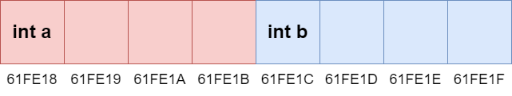
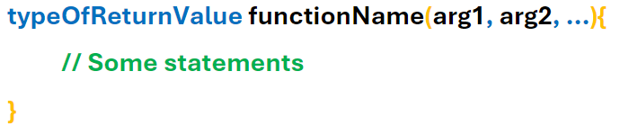

# Session 2 - The Cequel

Welcome to the Cequel! 
<small> See what I did there </small>

I hope you enjoyed Session 1 and are now comfortable with using variables, for loops, and if statements to create very basic **C** programs (including commenting and being able to compile your code), and are familiar with undefined behaviour and arrays - we can now start to explore  

It's getting to the harder stuff ...

Good luck and happy coding!

- CHANGE THE README 

## Contents 

- <a href="#Pointers" style="color: black;"> Pointers </a>
    - <a href="#MemoryAddresses" style="color: black;"> Memory Addresses </a>
    - <a href="#ThePoint" style="color: black;"> The Point (Intro to Pointers) </a>
    - <a href="#Dereferencing" style="color: black;"> Dereferencing </a>
    - <a href="#NullPointer" style="color: black;"> The Null Pointer </a>
    - <a href="#PointerExercises" style="color: black;"> Pointer Exercises </a>
- <a href="#Functions" style="color: black;"> Functions </a>
    - <a href="#Functions" style="color: black;"> Revisiting Hello World </a>

- <a href="#Input" style="color: black;"> Reading Input </a>

## <a name="Pointers"> Pointers </a>

We are about to learn arguably the most fundamental part of **C**: pointers. They may seem scary but we'll soon see that they're not *actually* that bad! 

### <a name="MemoryAddresses"> Memory Addresses: How Variables Are Stored </a>

We know that variables store values for us; but what does this actually look like, in the memory of our computers? 

Let's think about the following variable initialisations:
```c
char a = 5;
char b = 14;
```

These variables correspond to the following address table:

| Memory Address | Value Stored |
| -------------- | ------------ |
| 6422039        | 5            |
| 6422040        | 14           | 

We can see that the variable **a** has been stored at 6422039, and that variable **b** has been stored at 6422040 (the next **memory address**). These **memory addresses** tell you where you'd find the variables in all of the RAM your computer is currently using so they tend to be fairly large values.

 Memory addresses are actually in **binary** (which uses only 2 symbols: `0, 1`) and converting to **denary** (our numbering system which uses 10 symbols: `0, 1, 2, 3, 4, 5, 6, 7, 8, 9`) is a bit of a pain, so we don't usually represent addresses with denary. However, because of the large values that memory addresses tend to be, we can't exactly read them in their binary form since you get values like this: `11000011111111000010111` (`6422039` in binary). 

 Therefore, we typically represent addresses using **hexadecimal** (which uses 16 symbols: `0, 1, 2, 3, 4, 5, 6, 7, 8, 9, A, B, C, D, E, F`) which is both more compact than binary and, unlike denary, can be easily converted to and from binary. 
 
 Our memory addresses in various different bases:

| Denary  | Binary                    | Hexadecimal (what is commonly used!) | 
| ------  | ------------------------- | ------------------------------------ |
| 6422039 | 11000011111111000010111   | 61FE17                               |
| 6422040 | 11000011111111000011000   | 61FE18                               |

### <a name="ThePoint"> The Point </a>

It turns out that we can actually access the memory address of a variable in **C**, with the **address** operator (**&**). This returns a value which is the memory address of a variable so this value is said to **point** to that variable. This value is a **pointer**! Pointers have their own format specifier **%p** (**p** for **p**ointer) which we'll use to inspect some pointers:

```c
char a = 5;
char b = 14;

printf("%p\n", &a); // 61FE17
printf("%p\n", &b); // 61FE18
```

So we know variable **a** is stored at memory address `61FE17`, and variable **b** is stored at memory address `61FE18`. 

So far, we've only been dealing with pointers to **char** which is convenient since each char takes up **1 byte** in most machines, and each bit of memory (that has an address) stores **1 byte** of memory; what about ints which typically take up **4 bytes**? How are these stored in memory? 

```c
int a = 7;
int b = 22; 

printf("%p\n", &a); // 61FE18
printf("%p\n", &b); // 61FE1C
```

This can be visualised:


*Red cells are taken up by int a, blue cells are taken up by int b*

Since each cell (bit of memory) can store 1 byte and ints take up 4 bytes, each int covers 4 cells. The pointer contains the memory address of the first cell; when you check the contents of a variable using its pointer, you have to keep in mind the number of bytes it takes up so you know how many cells to check.  

We can also initialise variables for pointers which require:
1) the **type** of value it's pointing to 
2) a **memory address** (the variable's value) 
3) a **name** for the variable
4) an asterisk **\*** to tell **C** that it's a pointer


Of course, you can opt to just *declare* the pointer and not give it a value but this will lead to undefined behaviour.

- different ways of formatting pointers (where to position *)

### <a name="Dereferencing"> Dereferencing Pointers </a>

We can access the value pointed to by the pointer by using the **dereferencing** operator (**\***); ***don't get confused*** by the fact that **\*** is used both in the **type** when you're declaring a variable and as the dereferencing operator - they are completely different uses of the symbol!

```c
int a = 51;
int* pointerToA = &a;
int b = *pointerToA; // the pointer "pointerToA" is said to be dereferenced here 
```

So we can access the value stored by pointers by dereferencing the pointer, and actually manipulate it as well:

```c
int a = 3;
int* pointerToA = &a;

(*pointerToA)++; // updating a 

printf("%d\n", a); // 4
```
*Recall that you do the operations inside the brackets first!*

### <a name="NullPointer"> The Null Pointer </a>


### <a name="PointerExercises"> Pointer Exercises </a>

- Hex and Binary exercise (explain how to use)


## <a name="Functions"> Functions </a>

If you want to write good code, then you want to write organised code. You want to write code that easily clicks into place with other code like lego, and can be easily reused.
This is called **Adaptability:** how easily and quickly you can modify your code to introduce new features. 

We can organise our code more with **functions**, which we've already been using (**printf** is a function)! A function is a block of code that we can execute by **calling** the function, with some properties:
- you can pass values to the function by calling the function with **arguments**; think about *printf* - it wouldn't be very useful if you couldn't pass it the values you want to output 
- the function *can* **return** a *single* value to its caller

The syntax of declaring a function:



### <a name="Main"> Revisiting Main </a>


### <a name="PassingPointers"> Passing Around Pointers </a>

- Mention that this is a way of returning multiple arguments 
- arguments: difference between passing a pointer, and passing a regular old value 


### <a name="FunctionExercises"> Function Exercises </a>


## Revisiting Arrays 

- RESEARCH and mention that arrays decay into pointers
- Mention strings are arrays of chars?

- Pointer arithmetic
- wow, sizeof kind of makes sense -> sizeof arrays, sizeof int. Crazy 

## Input 

- a mid-way (maybe end-level) exercise: create a function for processing int input safely 

USEFUL ARTICLE: https://www.geeksforgeeks.org/all-forms-of-formatted-scanf-in-c/
USEFUL EXERCISE: https://www.hackerrank.com/challenges/playing-with-characters/problem?isFullScreen=true

- Recommend Hackerrank? 

## <a name="Macros"> Intro to Macros </a>

- booleans using macros 
- mention it'll be useful for next session (sneak peak?)

## MEMORY MANAGEMENT!!! 

- malloc, calloc, realloc

## Next Session…

Well done on completing Session 2! You're almost through to the end; just one more session to go... 

If you're not tired of C by then, then remember there's a bonus session on (INSERT DATE) 

- maybe do static keyword? 

- do structs and unions!

- Makefiles (and multiple files) -> header files? More complicated macros!

## <a name="OptionalExercises"> Optional Exercises </a> 

Not sure what to put here yet 

## Acknowledgements

Thanks to ...
Originally created by Edward Denton. 
